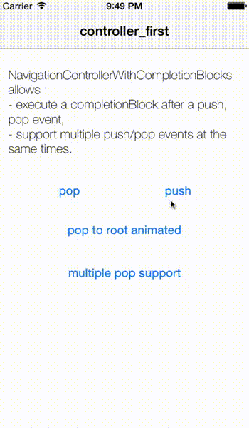
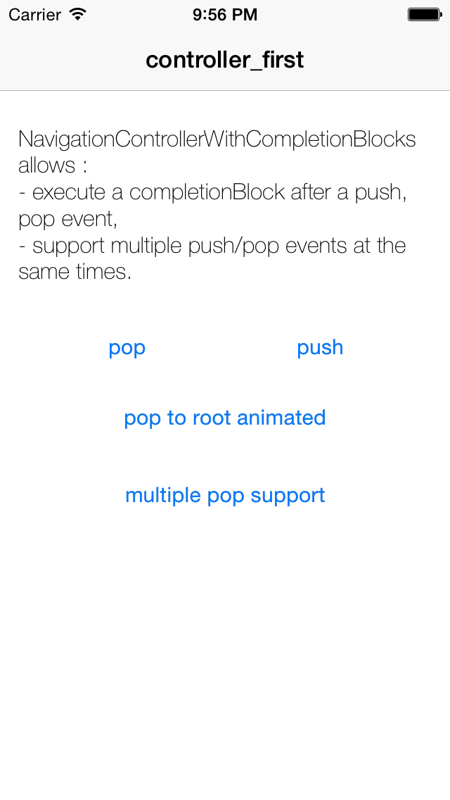

## My other works

[http://leverdeterre.github.io] (http://leverdeterre.github.io)

UINavigationControllerWithCompletionBlock
==============================

[](http://twitter.com/leverdeterre)
[](https://github.com/leverdeterre/UINavigationControllerWithCompletionBlock/blob/master/LICENSE)
[](https://github.com/leverdeterre/UINavigationControllerWithCompletionBlock)
[](https://travis-ci.org/leverdeterre/UINavigationControllerWithCompletionBlock)


The UINavigationController missing API ! (push / pop with optional completionBlock). 
The implementation use the navigationController delegate on UINavigationController itself.


This project provides : 
* A completionBlock to manage your push/pop events,
* A safe way to push/pop multiple controllers at the same times.
```objc

   [self.navigationController popViewControllerAnimated:YES withCompletionBlock:NULL];
   [self.navigationController popViewControllerAnimated:YES withCompletionBlock:NULL];
   [self.navigationController popViewControllerAnimated:YES withCompletionBlock:NULL];
```
* No more "Nested pop animation can result in corrupted navigation bar", 
* No more "Finishing up a navigation transition in an unexpected state. Navigation Bar subview tree might get corrupted."
* No more crash because of deallocated controllers between your multiple animations.



New methods 
---------------------------------------------------

```objc
- (void)pushViewController:(UIViewController *)viewController 
                 animated:(BOOL)animated 
      withCompletionBlock:(JMONavCompletionBlock)completionBlock;

- (void)popViewControllerAnimated:(BOOL)animated 
              withCompletionBlock:(JMONavCompletionBlock)completionBlock;
- (void)popToRootViewControllerAnimated:(BOOL)animated
                    withCompletionBlock:(JMONavCompletionBlock)completionBlock;
```

Swizzled methods 
---------------------------------------------------
```objc
- (void)pushViewController:(UIViewController *)viewController animated:(BOOL)animated; 
- (UIViewController *)popViewControllerAnimated:(BOOL)animated;
```

Usage UINavigationController+CompletionBlock
-------------------------------------------------------------
* (OPTIONAL) Activate Swizzling to redirect push/pop native calls to custom implementation. This swizzling is interesting if you don't want to replace all your push/pop methods, or, if you implement your own NavigationControllerDelegate.
```objc
typedef NS_OPTIONS(NSUInteger, UINavigationControllerSwizzlingOption) {
    UINavigationControllerSwizzlingOptionDelegate       = 1 << 0,
    UINavigationControllerSwizzlingOptionOriginalPush   = 1 << 1,
    UINavigationControllerSwizzlingOptionOriginalPop    = 1 << 2
};

+ (void)activateSwizzling;
+ (void)activateSwizzlingWithOptions:(UINavigationControllerSwizzlingOption)options;
```

*  Use the new pop/push methods (no need swizzling because your are calling custom methods)
```objc
[self.navigationController popViewControllerAnimated:YES withCompletionBlock:NULL];
[self.navigationController pushViewController:vc animated:YES withCompletionBlock:^(BOOL successful) {
   NSLog(@"Hi ! Push done !");
}];
```

* Use "old" Apple API. (Required Swizzling). The native calls will be redirected to the new custom API with default NULL completionBlock.
```objc
[self.navigationController popViewControllerAnimated:YES];
[self.navigationController pushViewController:vc animated:YES];
```

Installation using pods 
-------------------------------------------------------------
Just add the following line in your podfile

	pod 'UINavigationControllerWithCompletionBlock'
	




